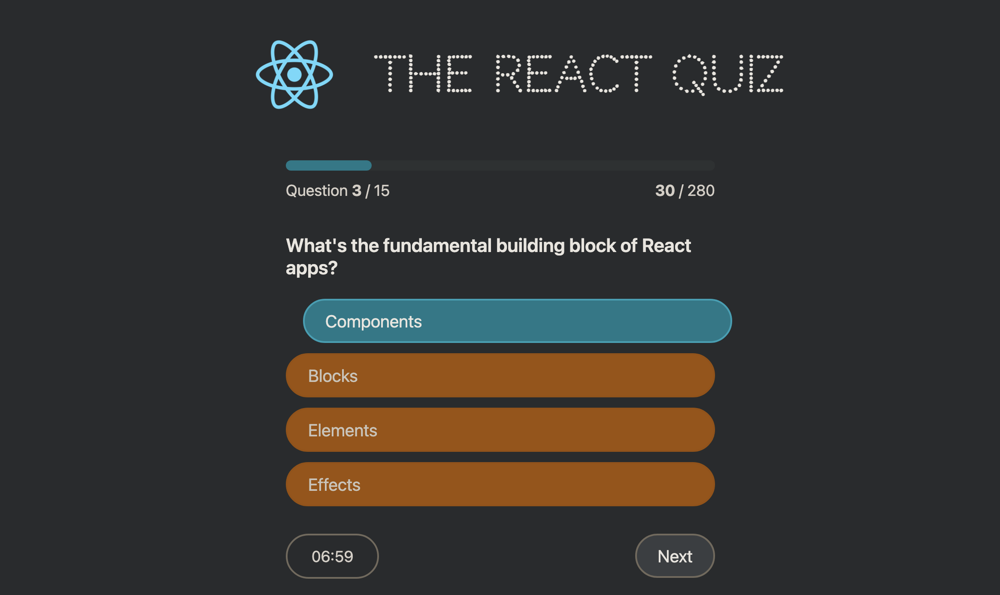

# 🧠 The React Quiz

A fun and interactive quiz app built with **React**. This project is designed to test your knowledge of React concepts while demonstrating the use of **state management with `useReducer`**, **data fetching with a fake API (`json-server`)**, and **React component-based architecture**.



## 🚀 Features

- **15 engaging React-related questions**
- **State management using `useReducer`** for handling quiz logic
- **Fake API integration** using `json-server` for fetching questions
- **Progress tracking** with points and high scores
- **Built-in timer** to keep things challenging
- **Sleek and modern UI** with a dark theme

---

## 🛠️ Tech Stack

- **Frontend**: React (Vite)
- **State Management**: `useReducer`
- **Backend (Fake API)**: `json-server`

---

## 📦 Installation & Setup

1️⃣ **Clone the repository**

```sh
git clone https://github.com/yourusername/react-quiz.git
cd react-quiz
```

2️⃣ **Install dependencies**

```sh
npm install
```

3️⃣ **Start the fake API server**

```sh
npm run server
```

This will start `json-server` and serve the quiz questions from `data/questions.json` at `http://localhost:8000/questions`.

4️⃣ **Run the React app**

```sh
npm run dev
```

This will start the app on `http://localhost:5173/` (or another available port).

---

## 🎮 How It Works

- The app **fetches quiz questions from a fake API** (`json-server` running locally).
- **State is managed using the `useReducer` hook**, keeping the app logic structured and scalable.
- The quiz progresses as users answer questions, with scores updating dynamically.
- A **timer** runs for each question, making the challenge more engaging.
- Once completed, users see their **final score** and **high score**.

---

## 🏗️ Project Structure

```
📂 src
 ├── components/
 │   ├── Header.js
 │   ├── Main.js
 │   ├── Question.js
 │   ├── NextButton.js
 │   ├── Timer.js
 │   ├── Progress.js
 │   ├── FinishScreen.js
 │   ├── Loader.js
 │   ├── Error.js
 │   ├── Footer.js
 ├── App.js
 ├── index.js
 ├── styles.css
📂 data
 ├── questions.json  // Fake API data
```

---

## ⚡ Key Concepts Used

✅ **useReducer Hook**:  
The `useReducer` hook is used to manage the quiz state. Actions like `dataReceived`, `start`, `newAnswer`, `nextQuestion`, and `finish` handle different states of the quiz dynamically.

✅ **Fake API with `json-server`**:  
Instead of a real backend, the app fetches quiz questions from a local JSON file served using `json-server`.

✅ **Component-Based UI**:  
The app is structured into reusable React components for modular and maintainable code.

---

## 📌 Future Improvements

🔹 Add difficulty levels (easy, medium, hard)  
🔹 Implement user authentication for personalized high scores  
🔹 Add animations for better UI experience

---

## 🎯 Contributing

Feel free to fork this repo, improve the quiz, and submit a pull request! 🚀

📩 **Questions or feedback?** Reach out anytime! 😃
